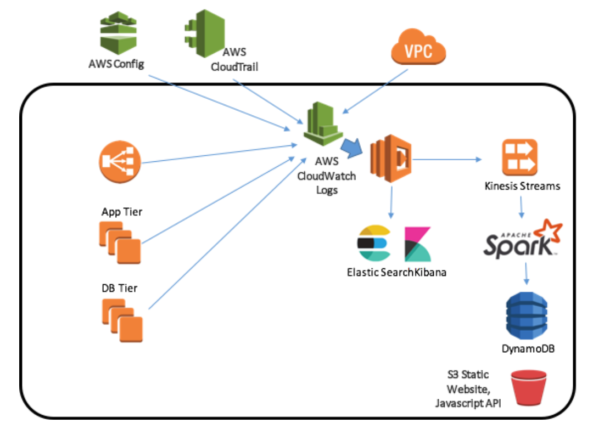

# probable-cause
A framework to classify enterprise cloud system and application health to enable rapid / proactive automated response

## Architecture

## Aggregation
*AWSConfig Events to CloudWatch Logs*
(Time relevance: a few days, does not repeat, losing rank with age unless "resolved")

*CloudTrail Events to Cloudwatch Logs*
(Time relevance: a few days, does not repeat, losing rank with age unless "resolved")

*VPC Flow Logs Events to Cloudwatch Logs*
(Time relevance: a few hours, likely repeats)

*Cloudwatch for Apps to Cloudwatch Logs*
(Time relevance: a few hours, likely repeats)

## Distribution
*Cloudwatch Subscription to Elastic Search*

*Cloudwatch Subscription to Kinesis*

## Analysis
*Kinesis Stream to Spark*

## Dashboard 
*DynamoDB updates front end display*

## Demo Assets (internal only)

Jenkins
http://ec2-18-234-64-58.compute-1.amazonaws.com/jenkins/

Kibana
http://centralized-logging-aws-elk-1696840377.us-east-1.elb.amazonaws.com/_plugin/kibana/

Spark Dashboard
http://ec2-34-198-7-204.compute-1.amazonaws.com:8080/

Probable Cause
http://insight-probable-cause-web.s3-website-us-east-1.amazonaws.com/

## Code Layout

*Elasticache and Kibana Stack - Cloudformation*
> Probable Cause > Cloudformation > Dev

*CloudWatch Log Subscriptions*
> Probable Cause > lambdas > logstreamer

*Website Results - Static S3 and Lambda*
> Probable Cause > web_results

*Contextual Analysis*
> Probable Cause > pyspark

## Demonstrate Scenarios
- Collect the events from all sources, aggregate them by type
- Reboot an instance 
- Detect the CloudTrail event "of interest" (which ranks high in probable cause)
- The Probable Cause of outage at the application layer is likely a reboot, update the historical record table to reflect this state
- If a security group changes later, blocking access, but the previous reboot issue was not "acknowledged", how to determine which event is the current root cause and not a symptom of the first issue?
- The scope of the error is targeted to the layer: application, network and cloud system. Each layer will keep a historical record of each probable cause.  In this case, the security group change would highlight a newer event "of interest" on the network layer while the cloudsystem layer is satisfied that it has already registered a probable cause.
- If the network layer has no recent events of interest, it will defer to the last probable cause allowing for correlation between a cloudsystem reboot and eventual network access errors.
- How to prevent cascading errors from flooding the usability of the system?  Using aggregations, if the same probable causes are occurring repeatedly, simply update the meta data of the probable cause with the occurrance counts, saving the first and last occurance timestamps.
- How to determine the if the VPC network traffic IP is of interest?  There are many bots REJECTED on the periphery, how to determine which IPs are functionally relevant?  This is a customization, by default, it is assumed that any network traffic that is within your VPC boundaries (or AWS Services) is safe and relevant. 
- How do you map a VPC REJECT event to an application since these IPs can change dynamically?  Since I'm attempting to keep this agentless - there will be a scheduled (Lambda) process that will update a lookup table with end point IPs from APIGateway, ELBs and Instances tagged with the application identifier.  If a source IP is in the accepted CIDR range (e.g. VPC, Route53, AWS API gateway or on-prem) and is REJECTED, this source IP finds its application id in the lookup table.  Similarly for the TARGET IP, if the target IP is in the accepted CIDR range, lookup its application id.  Both of these identifiers will update the network layer events "of interest" for their corresponding event tables.

## Schemas

*ApplicationLookupByIP*
_____________________
IP
ApplicationId
Endpoint type 

e.g. 
10.01.01.01, app1, ELB
10.01.01.10, app1, Instance
10.01.01.11, app1, API Gateway
10.01.01.33, app2, Instance
10.01.10.33, app2, Instance

*EventsOfInterestByApplication*
_____________________
ApplicationId
EventType
EventRelevence
FirstSeenDate
LastSeenDate
Count
EventContextSummary
EventMessage

e.g. 
app1, network, 8, 12:00:01, 12:05:22, 213 "REJECT on Instance 10.01.01.10", "[Orig Msg]"
app1, network, 8, 12:00:01, 12:05:22, 213, "REJECT on ELB 10.11.11.10", "[Orig Msg]"
app1, cloudsystem, 8, 12:00:01, 12:05:22, 1, "REBOOT on Instance 10.01.01.10", "[Orig Msg]"
app2, cloudsystem, 8, 12:00:01, 12:05:22, ...
app1, application, 6, 12:00:01, 12:05:22, 2, "DB CONN error on 10.01.01.10", "[Orig Msg]"
app2, application, 8, 12:00:01, 12:05:22, ...

*SystemStateRecordsByApplication*
_____________________
ApplicationId
EventType
EventRelevence
FirstSeenDate
LastSeenDate
Count
EventContextSummary
EventMessage

## Spark Local Installation Notes
> xcode-select —install
If already exists, and you want to update
> rm -rf /Library/Developer/CommandLineTools
Re-install
> xcode-select --install
>brew install scala
export SPARK_HOME=/usr/local/Cellar/apache-spark/2.0.1/libexec
export PYTHONPATH=/usr/local/Cellar/apache-spark/2.0.1/libexec/python/:$PYTHONP$

